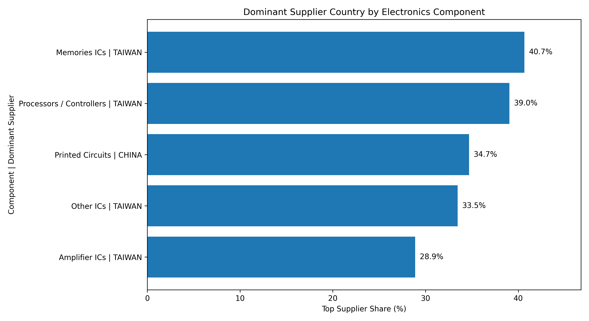
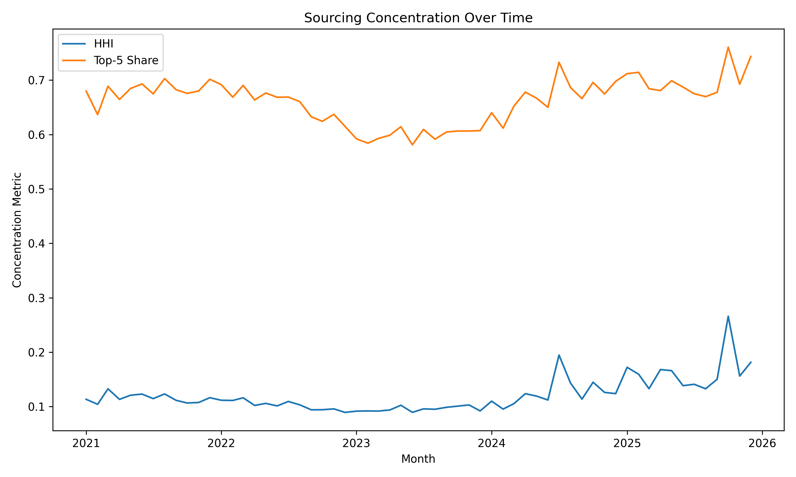
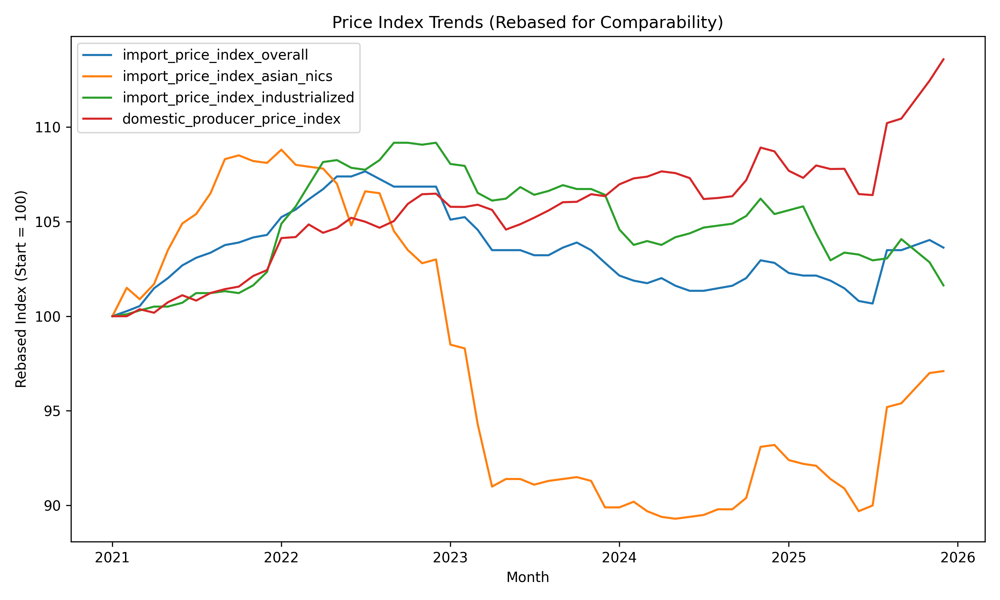
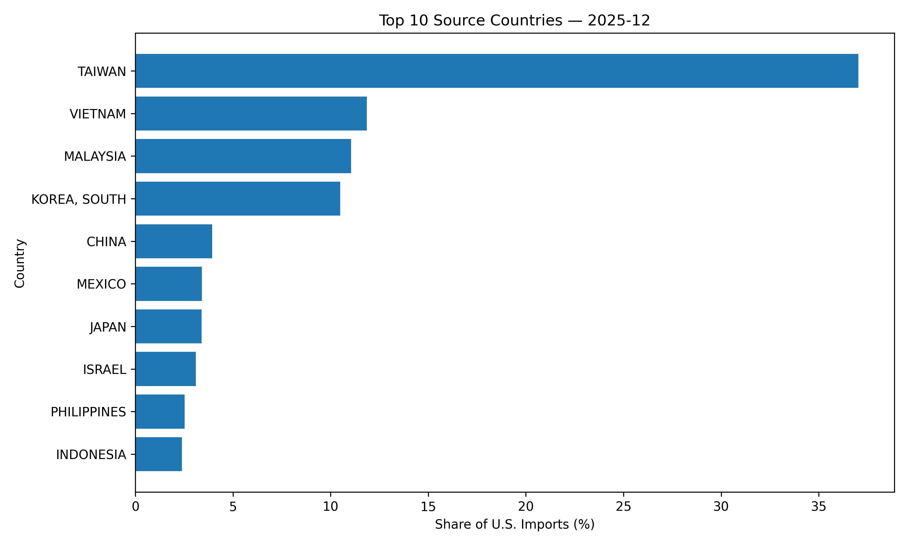
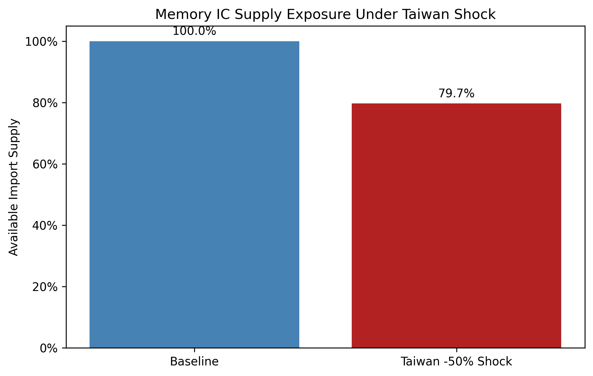
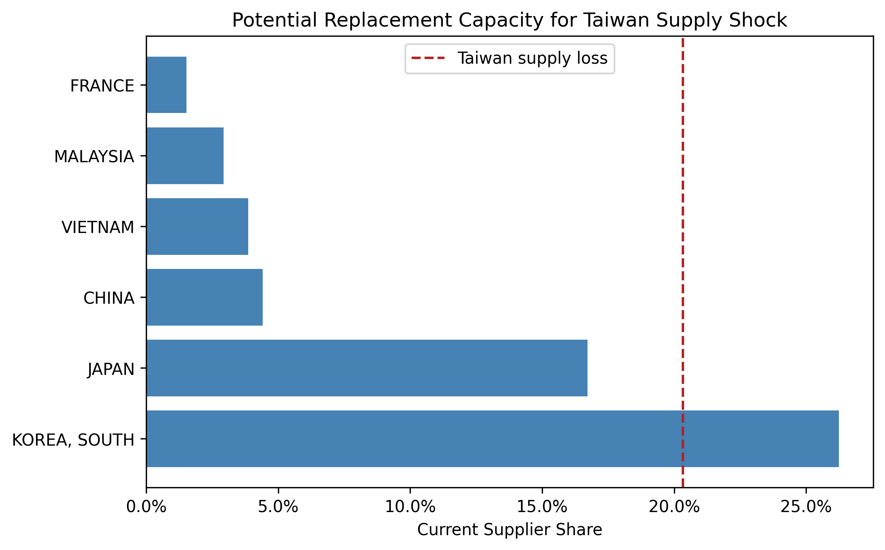
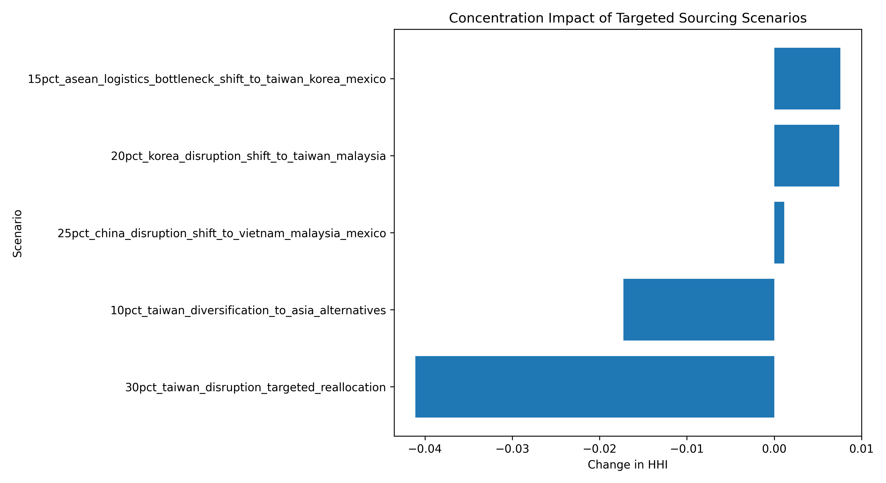
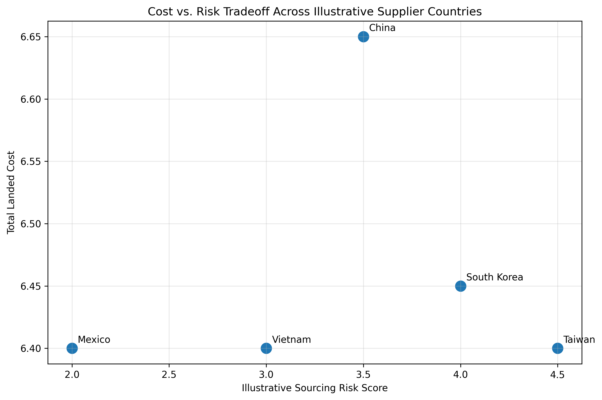

# Country- and Component-Level Sourcing Risk Analysis for Electronics Components

A procurement-focused side project built to better understand how concentrated U.S. electronics sourcing is at the component level using public Census trade data and BLS/FRED price indexes.

This project was motivated by my interest in procurement analytics and global manufacturing, especially in East Asian supplier ecosystems relevant to electronics, robotics, and Hyundai/Boston Dynamics-style supply chain contexts.

---

## Executive Summary

Broad industry-level concentration can look manageable. But the sharper HS6 component-level view tells a more decision-relevant story: several core electronics categories depend heavily on a small number of supplier countries, with Taiwan dominating multiple integrated-circuit categories and China leading printed circuits.

### Latest Component Supplier Summary

| HS6 Code | Component | Top Supplier | Top Supplier Share | Top 3 Supplier Share | Risk Band |
|---|---|---:|---:|---:|---|
| 854232 | Memory ICs | Taiwan | 40.7% | 83.6% | Highly concentrated |
| 854231 | Processors / Controllers | Taiwan | 39.0% | 76.5% | Moderately concentrated |
| 853400 | Printed Circuits | China | 34.7% | 64.2% | Moderately concentrated |
| 854239 | Other ICs | Taiwan | 33.5% | 58.4% | Moderately concentrated |
| 854233 | Amplifier ICs | Taiwan | 28.9% | 55.6% | Unconcentrated |

### Key Findings

- **Memory ICs are the most concentrated component in the basket.** Taiwan, South Korea, and Japan account for roughly 83.6% of U.S. memory IC imports.
- **Processors/controllers are also heavily dependent on a narrow supplier base.** Taiwan alone supplies about 39.0%, with Malaysia and Israel following.
- **Printed circuits follow a different sourcing pattern.** China is the dominant supplier at about 34.7%, followed by Taiwan and South Korea.
- **Risk is not uniform across the electronics stack.** Some component categories are highly concentrated, while others are more diversified.



---

## Why I Built This

I wanted to build a project that looked more like a real procurement analytics question than a generic student data project. For a manufacturing or robotics company, the issue is not just total electronics exposure, but it is whether specific component families depend too heavily on a small set of countries or regions.

---

## The Question

Where does the U.S. source semiconductors and electronic components from, how dependent is it on a handful of countries, and has that concentration become more or less pronounced over time?

---

## What I Found

### 1) The broad view understates the sharper component-level risk

At the NAICS 3344 level, concentration appears only moderate. But that broad industry view smooths over the categories procurement teams actually worry about. The HS6 analysis shows that several critical component families are much more concentrated than the aggregate picture suggests.

### 2) Concentration has been creeping up over time

HHI scores trend upward from 2023 through 2025. That does not automatically imply a sourcing crisis, but it does suggest that import dependence is becoming more concentrated in fewer countries over time.

HHI (Herfindahl–Hirschman Index) is a concentration measure: higher values mean sourcing is more dependent on fewer countries.



### 3) Price pressure shifted over time

Asian import prices fell after 2022, while domestic producer prices continued rising. That suggests cost pressure increasingly shifted from the import side toward domestic production rather than disappearing altogether.



### 4) Asia-Pacific manufacturing hubs still dominate the supplier landscape

Taiwan, South Korea, Vietnam, Malaysia, and ASEAN-linked supplier regions remain central to the sourcing mix. Even where top-country shares differ by component, the broader geography remains concentrated in the Asia-Pacific electronics ecosystem.



---

## Sourcing Implications

This project does **not** claim to solve supplier selection or total landed cost. Its goal is to identify where concentration risk appears high enough to justify procurement attention.

### Finding 1: HS6-level concentration is sharper than the broad industry view suggests
**Why it matters:** A robotics or manufacturing company may look reasonably diversified at the aggregate level while still being exposed in a few critical component families.  
**Decision question:** Which component categories should be prioritized for second-source review, qualification planning, or supplier mapping?

### Finding 2: Memory ICs and processors/controllers appear especially concentrated
**Why it matters:** High dependence in these categories can create disproportionate disruption risk if a small number of countries face shocks, bottlenecks, or trade restrictions.  
**Decision question:** For the most concentrated components, where should a procurement team evaluate alternate sourcing, safety stock review, or deeper supplier-tier visibility?

### Finding 3: Different component families have different country-risk profiles
**Why it matters:** Printed circuits and integrated circuits do not show the same sourcing pattern, so “electronics risk” cannot be treated as one uniform category.  
**Decision question:** Should category strategies be segmented by component family rather than managed under one broad electronics sourcing assumption?

### Example disruption scenario: Taiwan semiconductor shock

To translate supplier concentration into operational risk, I simulated a disruption scenario where Taiwan semiconductor exports fall by 50% for HS6 memory ICs (854232) using the most recent month of trade data.

Taiwan currently supplies roughly 40% of U.S. memory IC imports. A 50% reduction in Taiwan exports therefore removes about 20% of available supply in the short run, assuming other suppliers cannot immediately replace that volume.

This simple scenario highlights how concentrated supplier structures can create disproportionate disruption exposure even when the broader electronics supply chain appears diversified.



### Who could replace Taiwan supply?

The dashed line shows the amount of supply lost under the Taiwan disruption scenario. The bars represent the current supplier shares of other countries, illustrating how multiple suppliers would likely need to expand production to replace Taiwan's lost volume. 

This comparison uses current supplier shares as a proxy for potential replacement capacity. In reality, replacing Taiwan supply would depend on whether existing producers could expand fabrication capacity, redirect exports, or whether firms could qualify alternate suppliers.



### Simple scenario lens
If Taiwan share were to fall materially in a highly concentrated IC category, the key procurement issue would not just be replacement volume. It would be whether alternate countries or suppliers are already qualified, commercially viable, and operationally scalable.

That is the practical bridge from concentration analysis to sourcing action.



### Illustrative cost vs. risk tradeoff

To extend the project from concentration analysis into procurement decision-making, I added a simple landed-cost scenario model comparing supplier countries across unit cost, shipping, tariffs, and a risk premium. This is not a supplier quote model; it is an illustrative framework for thinking about sourcing tradeoffs.



A procurement team would generally prefer options closer to the lower-left of the chart: lower total landed cost with lower sourcing risk. The point is not that one country is always “best,” but that sourcing decisions involve balancing cost efficiency against concentration and disruption exposure.

---

## Data Sources

- **U.S. Census International Trade API** — monthly imports by country, NAICS 3344 (Semiconductor and Electronic Component Manufacturing)
- **U.S. Census International Trade API** — HS6 component-level trade flows for selected electronics categories
- **FRED / BLS** — import price index for NAICS 3344, Asian NIC origin prices, industrialized-country prices, domestic producer price index

All data are public and the workflow is reproducible.

---

## How It Works

Three scripts, run in order:

1. `fetch_data.py` — pulls Census and FRED data  
2. `build_dataset.py` — computes country shares, moving averages, and HHI  
3. `make_charts.py` — generates the charts and output tables

---

## Repo Structure

```text
electronics-sourcing-risk-benchmark/
├── README.md
├── FINDINGS.md
├── requirements.txt
├── data/
│   ├── raw/
│   └── processed/
├── outputs/
│   ├── charts/
│   └── tables/
└── src/
    ├── fetch_data.py
    ├── build_dataset.py
    └── make_charts.py